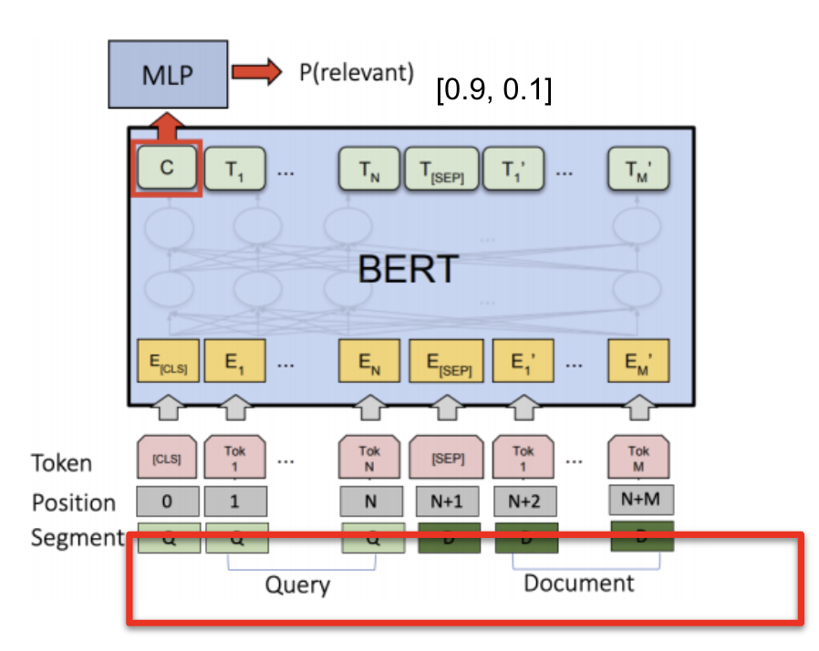
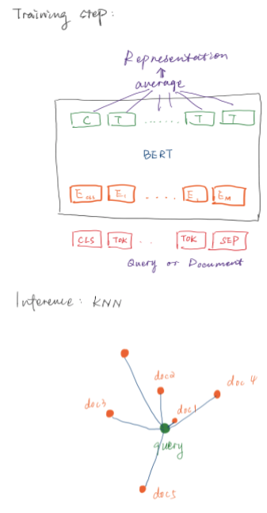

# Document Reranking: Information Retrieval Using Contextual Language Models for Document Representation Learning

***Team***: Celine Liu, Sheena Salwan, Kishan Maladkar, Kristian Berg

***Mentor***: Ganesh Jawahar

## Abstract

Before the advent of Contextual Language Models like BERT and T5, most
information retrieval (IR) based systems relied solely on simple keyword
based approaches, where natural language queries are broken down into
word tokens, the common words (known as stop words eg: "the") removed,
and then potential documents scanned to see if these remaining
"keywords" are contained within a document. This approach is still
widely used in IR systems, and indeed, serves as the basis for neural
methods employed in our experiments and elsewhere. In Neural IR, the
keyword approach is the first step in the retrieval process, and a layer
of ML is subsequently applied to "re-rank" the retrieved document by
either a relevance score or label. 

\
Our project involved experiments in document re-ranking with three
different forms of contextual language models:
"DistilBertForSequenceClassification", "DistilBertForMaskedLM" and
"T5-Base". All of our models were implemented in PyTorch via the
HuggingFace API, and evaluated against "Mean Reciprocal Rank" a "rank
aware" evaluation metric. Our research shows that contextual language
models can improve upon the keyword approach in information retrieval
tasks by considering the nuances and structure of natural  language,
which can make use of the often discarded stop words and order of the
word tokens in the query when finding relevant passages pertaining to a
users query.

## Introduction

Our team's project explored improvements contextual language models make
over a strictly keyword approach in the document retrieval IR task. Our
task requirements were far reaching, and were largely informed by the
following papers from researchers at Carnegie Mellon: [Deeper Text
Understanding for IR with Contextual Neural Language
Modeling](https://www.cs.cmu.edu/~callan/Papers/sigir19-Zhuyun-Dai.pdf),
and Waterloo: [Document Ranking with a Pretrained Sequence-to-Sequence
Model](https://cs.uwaterloo.ca/~jimmylin/publications/Nogueira_etal_FindingsEMNLP2020.pdf#page=10&zoom=100,89,476).
Specifically, we compared the performance of three differing
Sequence-to-Sequence contextual language models in our relevance
re-ranking task:  "DistilBertForSequenceClassification",
"DistilBertForMaskedLM" and "T5-Base". All of these models were
implemented in Pytorch through the HuggingFace API, and their
performance evaluated on a handcrafted subset of Microsofts' MARCO
Passage Dataset. 

\
The baseline model for our BERT suite of models is the Okapi-BM25
algorithm, which makes use of Term Frequency: the number of times a term
appears in a document, and Inverse Document Frequency: a measure of how
much information the word provides, i.e., if it's common or rare across
all documents. These two terms taken together can help determine how
relevant a document is to a specified query. After a list of documents
is returned from BM25, we apply our language models to "re-rank" this
returned list. (sidenote: The top 1000 passages as ranked by Okapi are
provided in MS-MARCO, so no implementation of our own was needed).
BERT's performance served as the baseline for our T5 model's
performance, as T5 is the state of the art Sequence2Sequence model (T5
is exciting as it frames every task as a Seq2Seq, task, i.e. taking an
input string, and outputting an output string depending on the task).
All of our models were then evaluated through a "rank aware" evaluation
metric known as Mean Reciprocal Rank to determine the order of relevance
for a given query , document set.

## Related Work

<em>Devlin et al.</em> [2] proposed BERT, a new language representation
using Transformers in 2018, which was a breakthrough in the NLP
community that achieved state-of-the-art in many NLP tasks [3], eg:
machine translation, text summarization, etc. The model encodes a text
input and decodes that to produce a prediction for a given task. In IR,
the task is to estimate a score on a passage to a query. Before 2018
BERT's effectiveness on standard passage retrieval tasks had yet to be
studied.

Latest research on neural-based models primarily studies text
presentation for the search task [4], as well as architecture design to
capture the text and passage signals [5], though less efforts have been
made on understanding the content of the query and the passage. <em>Dai
and Callan</em> [3] studied the possibility of using BERT to provide
deeper text understanding on query and passage for IR, and show that
contextual text representations from BERT are more effective than
traditional word embeddings (eg: bow, w2v, etc). Researchers at Waterloo
have since expanded on the work of <em>Nogueira and Cho</em> in using
contextual language models in Information Retrieval [4].

## Dataset(s)

Given the concerns for computational requirements and storage, we will
make use of a subset of the MS MARCO dataset, as the full size of
MSMARCO Passage is over 450GB. MSMARCO's small training set consists of
93,529 passages and 100 queries, each with \~1000 corresponding relevant
and irrelevant passages. We used this subset of the dataset to slice
into our training, development and test splits (70 / 20 /10). The
waterloo paper points out that the average token length of the passage
in MS MARCO is 460 tokens, and none of the processed data exceeded the
maximum sequence length of BERT or T5 (512 tokens); in this regard, the
dataset conforms to the maximum sequence requirements of BERT and T5 and
no truncation of the passages in pre-processing is necessary.

| **Dataset**           | **MSMARCO**                                                                                                                                                                                                                                                                  |
|-----------------------|------------------------------------------------------------------------------------------------------------------------------------------------------------------------------------------------------------------------------------------------------------------------------|
| **About**             | A subset of the initial 8.8 Million passages of the MS-MARCO dataset consisting of 93,529 passages. The goal is to rank these passages based on their relevance. Relevance labels are derived from what passages were marked as having the answer in the QnA dataset making this one of the largest relevance datasets ever.                                |
| **Task**              | Given a query q and the 1000 most relevant passages P = p1, p2, p3,... p1000, as retrieved by BM25 a successful system is expected to rerank the most relevant passage as high as possible. For this task not all 1000 relevant items have a human labeled relevant passage. |
| **Data type**         | Text                                                                                                                                                                                                                                                                         |
| **Genre**             | Based on the questions in the [MS-MARCO] Question Answering Dataset and the documents which answered the questions on Microsoft Bing Search engine.[Dataset paper](https://arxiv.org/abs/1611.09268)                                                                         |
| **Language**          | en                                                                                                                                                                                                                                                                        |
| **Style**             | Information Retrieval                                                                                                                                                                                                                                                                          |
| **Acquisition**       | [API requests](https://ir-datasets.com/msmarco-document.html), or[github](https://github.com/microsoft/MSMARCO-Passage-Ranking)                                                                                                                                              |
| **Storage**           | Local                                                                                                                                                                                                                                                        |
| **Evaluation metric** | eg: MRR@10

### MS MARCO Passage Data

Each of these files have been subsetted by our team from the original
train triples files included in the original MS-MARCO Passage dataset.

| **data**           | **size** | **\#records** | **format**                                                                  | **note**                                                                    |
|--------------------|----------|---------------|-----------------------------------------------------------------------------|-----------------------------------------------------------------------------|
| Diverse.triplets.train     | 1.5 MB  | 70469     | qid, pid, pid                                               | #unique queries: 3541, #unique passages: 72231
| Diverse.triplets.dev     | 452kb  | 20044     | qid, pid, pid                                               |#unique queries: 1012, #unique passages: 20871
| Diverse.triplets.test     | 224kb  | 10080     | qid, pid, pid                                               | #unique queries: 504 , #unique passages: 10540                                                 |
| Diverse.queries.all.tsv       | 208 KB | 5057      | qid, text | query_id,query_text, mapping                                                      |
| Diverse.passages.all.tsv          |  35 MB  | 93,529        | qid, text                                                               |  passage_id, passage_text mapping                                                                           |
| qrels.train.tsv(GOLD)    |    34MB      | 532761         | qid, x, pid, x; TREC qrels format, ignore the second and the fourth columns|           gold label, query:top1 passge ranked                                                                  |

-   The PyTorch dataloader loads the data in the form of tuples, where
    the first index is a query, second is a positive passage and third
    is a negative passage. 

-   The model inputs will be rows of [CLS] + [\<query\_tokens\>] +
    [SEP] + [\<passage\_tokens\>]. The embeddings are from the default
    transformer architecture which are embedded after preprocessing the
    inputs with truncation and padding with a maximum length of 512.

## Methods

**BERT**

For our BERT suite of models, we experimented with two different
approaches for performing the passage ranking task, a classification,
and distance based approach. Our classification based approach was
informed by the work of Dai and Callan [2], which uses a
classification-based ranking model to predict whether a given passage is
relevant, or non-relevant, to a query. The model takes a query and a
passage as input and outputs a probability which indicates the
likelihood that the passage is relevant to the query. At test time, a
ranking is computed based on the probability of the classification model
for each query. The first node of the last transformer layer is used as
a representation, and it is passed to a two-layer multi-layer perceptron
(MLP) with ReLU activation. The final output is followed by a softmax
function, and then the cross-entropy loss is used to calculate the
gradient updates. The entire model is trained end-to-end.

Our second approach utilized a distance-based ranking model that
computes the ranking based on the distances between queries and
passages. In this approach, the model learns a representation of the
input, a query or a passage. We used triplet margin loss to encourage
the query to be closer to relevant passages than non-relevant ones. At
test time, we compute the distance between a query and each passage, a
lower distance is given a higher ranking. 

For the classification-based model, we created two inputs which are the
concatenations of query and positive passage, as well as query and
negative passage. For the distance-based model, queries and passages are
treated as separate inputs; more specifically, they are not
concatenated. For each input string, we used a pre-trained tokenizer to
convert it to a tensor of indices. The input tensor is padded to the
longest input length and also truncated to a maximum length of 512 if
necessary. At the same time, the tokenizer outputs a mask tensor, which
is used to avoid the model from attending to the padding tokens.
Finally, the input and mask tensors are passed to the BERT model for
each approach as described in the earlier paragraphs.

**T5**

We implemented the Text-to-Text Transformer ("T5-base") model via the
Huggingface API. The T5's claim to fame is its unified "text to text"
format, where its outputs are always text strings, as opposed to BERT
style models, that only output either a class label or a span of the
input. Already pre-trained on a variety of NLP tasks, T5-Base comes
equipped out of the box with machine translation, sentiment analysis,
Q&A IR, and summarization capabilities. For our project we merely fine
tuned the model for document retrieval IR.

**Inputs**

The model inputs were slightly edited versions of the train / dev / test
splits we first inputted into BERT, so our datasets are not directly
comparable. Mainly, in order to get T5 to work properly, we first had to
balance the classes by removing some of the irrelevant passages; during
training we limited each batch size to 11, with 1 positive example
followed by 10 negative examples in each batch. We also eliminated
queries with competing "most relevant" passages to streamline the MRR
evaluation. We then processed the splits into JSONL format, where each
each row in our data files  consisted of a JSON object / Python
dictionary consisting of two keys:

{"input\_text": "Query: q, Document: d,  Relevance:", "target\_text":}

The "input\_text" key contains the input sequence to the model, where q
and d are a concatenated query and passage, and during training, the
target\_text key contained the token "true" for the passage with
positive relevance label, and "false" for passages with a negative
label.  In the course of our experiments, we ignored feeding attention
masks into the model, which helps the model attend to sequence without
padding tokens. This would be a useful feature to explore in future
work. 

**Outputs**

The model is trained to output a single token sequence: either "true" or
"false". In order to generate relevance rankings, we applied a softmax
to the logits corresponding to only the  "true" / "false" tokens, as
suggested by the waterloo researchers, and then sorted by maximum
probability, with the passage with the highest probability corresponding
to the "true" being determined as our most relevant passage.

\
**Loss**

We utilized Cross Entropy loss to optimize the model, and experimented
with the weight corresponding to the "false" token to additionally gauge
performance on the recall metric.\

## Experiments

**BERT**

Due to the size of our data and the scope of this project, we ran each
experiment with one epoch and a batch size of eight. A larger batch size
caused a GPU memory error. We used the Adam optimizer with a learning
rate of 3e-5. In each training iteration, we first calculate the loss
and update the model parameters as described earlier. Then, we evaluate
the model on the validation set every ten iterations. Based on the
validation accuracy, we performed early stopping once we saw the
accuracy started to plateau. The training time for each experiment is
about four to seven hours.

In the next paragraph, we describe the experiments three based on
classification-based models, and four based on distance-based models. We
then summarize the results in Table 1 and Figure 3 in the Results
section.

### Model 1: Classification-based Model

We used DistilBertForSequenceClassification as our pre-trained model.

::: {align="center" style="text-align: center;"}

**Figure 1: Classification-based Ranking Model Architecture**
:::

We ran three experiments with this approach: - E1: Use the pre-trained
model to test on the validation set without training - E2: Use the
pre-trained model to test on the validation set with training - E3:
Freeze the transformer layers, and only train the two-layer MLP

### Model 2: Distance-based Model

::: {align="center" style="text-align: center;"}

**Figure 2: Model Architecture for Distance-based Ranking Model**
:::

We ran 4 experiments based on this design: - E4: Training with triplet
loss margin=1.0, distance function=L2 - E5: Training with triplet loss
margin=0.1, distance function=L2 - E6: Training with triplet loss
margin=1.0, distance function=cosine - E7: Training by averaging the
last Transformer layer, instead of the first node

**T5**

At the time of writing, our inference with T5 is still in development.
The model has been successfully trained, and we initially believed we
had been conducting inference successfully, but when we probed our
results, and found inflated MRR scores  of \~97% we realized the
experiment design had been improperly implemented, and we are currently
reworking the design. We are hoping to have some results to show in the
corresponding notebook.

## Results

::: {align="center" style="text-align: center;"}
| Expriment |           Model|  Margin|  Distance Function|  Last Layer|  Validation Accuracy|
|-----------|---------------:|-------:|------------------:|-----------:|--------------------:|
| Exp1      |  Classification|      --|                 --|  First Node|                0.657|
| Exp2      |  Classification|      --|                 --|  First Node|                0.811|
| Exp3      |  Classification|      --|                 --|  First Node|                0.630|
| Exp4      |        Distance|     1.0|                 L2|  First Node|            **0.916**|
| Exp5      |        Distance|     0.1|                 L2|  First Node|            **0.921**|
| Exp6      |        Distance|     1.0|             Cosine|  First Node|                0.834|
| Exp7      |        Distance|     1.0|                 L2|     Average|            **0.918**|

**Table 1: Summary of Experiments (Top-1 Acccuracy)**
:::

::: {align="center" style="text-align: center;"}

**Figure 3: Classification-based Ranking Model Architecture**
:::

For BERT, Evaluation Results are:

| Experiment |       MRR@10   |  MRR@20|  
|-----------|---------------:|-------:|
| BERT      |  0.147         |   0.178|              

## Conclusion

Our project showed the challenges associated with working with not only
a large data set but large models and state of the art frameworks. At
the time of writing, our BERT implementations scored MRRs of close to
zero, and T5 is unable to infer at all. Part of the challenge in our
implementation approach was the balancing act between finding datasets
with enough data in order to fine tune the model, and sparse enough to
still implement on a GPU. Subsetting our data also led to other design
hurdles that we had not foreseen at the outset of the project, and
required additional development to get to work with our MRR evaluation
metric. If we had another month, Implementing both model architectures
on a TPU with a full dataset to submit to the MS MARCO Leaderboard would
be the goal.

## Reference

[1] A Deep Relevance Matching Model for Ad-hoc Retrieval. Jiafeng Guo,
Yixing Fan, Qingyao Ai, and W. Bruce Croft. arXiv 2016.
<https://arxiv.org/abs/1711.08611>. (2016)

[2] BERT: Pre-training of Deep Bidirectional Transformers for Language
Understanding. Jacob Devlin, Ming-Wei Chang, Kenton Lee, and Kristina
Toutanova. arXiv 2018. <https://arxiv.org/abs/1810.04805>. (2018)

[3] Deeper Text Understanding for IR with Contextual Neural Language
Modeling. Zhiyun Dai and Jamie Callan. SIGIR 2019.
<https://doi.org/10.1145/3331184.3331303>. (2019)

[4] Passage Re-ranking with BERT. Rodrigo Nogueira and Kyunghyun Cho.
arXiv 2019. <https://arxiv.org/abs/1901.04085>. (2019)

[5] Exploring the Limits of Transfer Learning with a Unified
Text-to-Text Transformer. Colin Raffel, Noam Shazeer, Adam Roberts,
Katherine Lee, Sharan Narang, Michael Matena, Yanqi Zhou, Wei Li, and
Peter J. Liu. arXiv 2020. <https://arxiv.org/abs/1910.10683>. (2020)

[6] Document Ranking with a Pretrained Sequence-to-Sequence Model.
Rodrigo Nogueira, Zhiying Jiang, and Jimmy Lin. arXiv 2020.
<https://arxiv.org/abs/2003.06713>. (2020)
